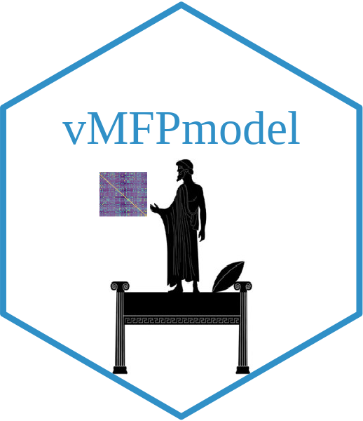

# The von Mises-Fisher-Procrustes model

In this repository, you can find 
  1. A short tutorial about the application of the von Mises-Fisher-Procrustes model using fMRI data;
  2. The code used for the between-subjects classification of the [Faces and Objects data](http://www.pymvpa.org/datadb/hyperalignment_tutorial_data.html) (Code/FacesObjects);
  3. The code used for the between-subjects classification of the [Raiders data](https://github.com/HaxbyLab/raiders_data) (Code/Raiders);
  4. The code used for the group level inference analysis of the [Auditory data](https://openneuro.org/datasets/ds000158/versions/1.0.0) (Code/Auditory);
  5. The main function describing the von Mises-Fisher-Procrustes model (vMFPmodel.py)

# Did you find some bugs?

Please write to angela.andreella[\at]stat[\dot]unipd[\dot]it or insert a reproducible example using [reprex](https://github.com/tidyverse/reprex) on my [issue github page](https://github.com/angeella/priorGPA/issues).

